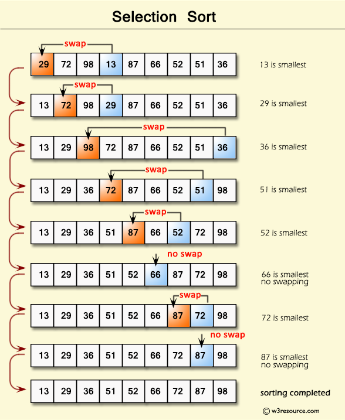
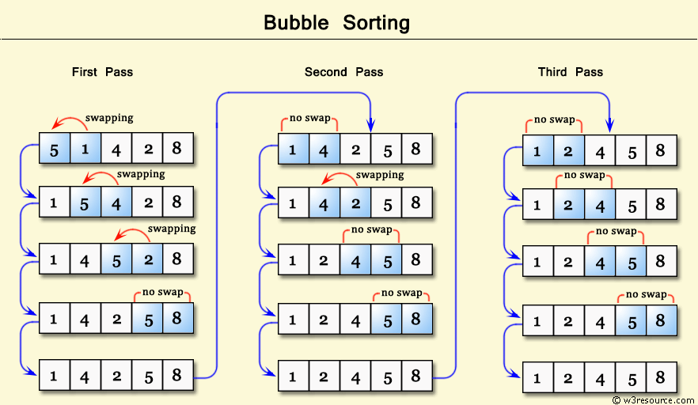
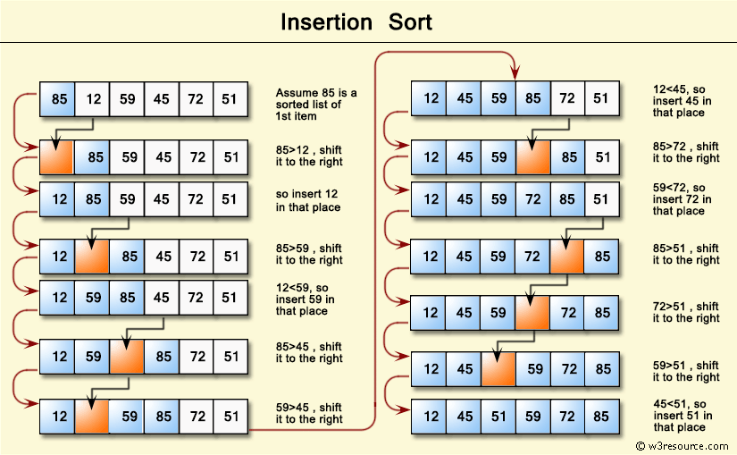

## Řazení výběrem (Selection Sort)
Selection Sort patří mezi jednoduché nestabilní řadící algoritmy. Jeho výhodou mezi algoritmy s obdobnou asymptotickou složitostí je především konstantní paměťová náročnost. Základní princip algoritmu pro seřazení čísel v seznamu vypadá následovně:

* Najdi nejmenší prvek v seznamu a prohoď jeho pozici s prvním prvkem seznamu.
* Najdi druhý nejmenší prvek v seznamu a prohoď jeho pozici s druhým prvkem seznamu.
* Opakuj činnost, dokud nejsou seřazeny všechny prvky.
* Vrať seřazenou posloupnost.

Vizuální ukázka pro první dva kroky algoritmu může vypadat např. takto:

## Bublinkové řazení (Bubble Sort)
Bubble Sort patří mezi nejjednodušší stabilní algoritmy řazení. Algoritmus pracuje na principu probublávání čísel požadovaným směrem. Základní princip algoritmu pro vzestupné seřazení čísel v seznamu vypadá následovně:

* Začni na první pozici.
* Porovnej dva po sobě jdoucí prvky. Pokud má první prvek větší hodnotu než prvek druhý, prohoď jejich pořadí.
* Posuň se o jednu pozici.
* Opakuj bod číslo 2 a 3 pro celou sekvenci. (Po prvním průchodu celou sekvencí došlo k probublání největší hodnoty na poslední pozici)
* Opakuj dokud není seřazena celá sekvence.

Vizuální ukázka pro první tři iterace algoritmu může vypadat např. takto:

## Řazení vkládáním (Insertion Sort)
Insertion Sort je další ze stabilních řadících algoritmů a v praxi bývá efektivnější než dosud zmíněné algoritmy Selection Sort a Bubble sort. Tento algoritmus funguje podobně jako třídění karet v ruce při některé z karetních her. Princip algoritmu pro vzestupné seřazení je následující:

* Začni na první pozici, tento prvek považuj za seřazený. Zbylou část sekvence považuj za neseřazenou.
* Vezmi první prvek z neseřazené oblasti.
* Porovnej tento prvek s jeho předchůdcem (tedy posledním prvkem v seřazené oblasti). Pokud je předchůdce větší než prvek, který chceme zařadit, posuň ho o jednu pozici doprava. (Tak vznikne místo pro nový prvek.) 
* Opakuj bod tři dokud existují v seřazené oblasti čísla větší než číslo, které chceme zařadit.
* Vlož prvek do seřazené oblasti.
* Pokračuj dalším prvkem z neseřazené oblasti, opakuj body 3 až 6.

Vizuální ukázka pro první tři iterace algoritmu je níže:

